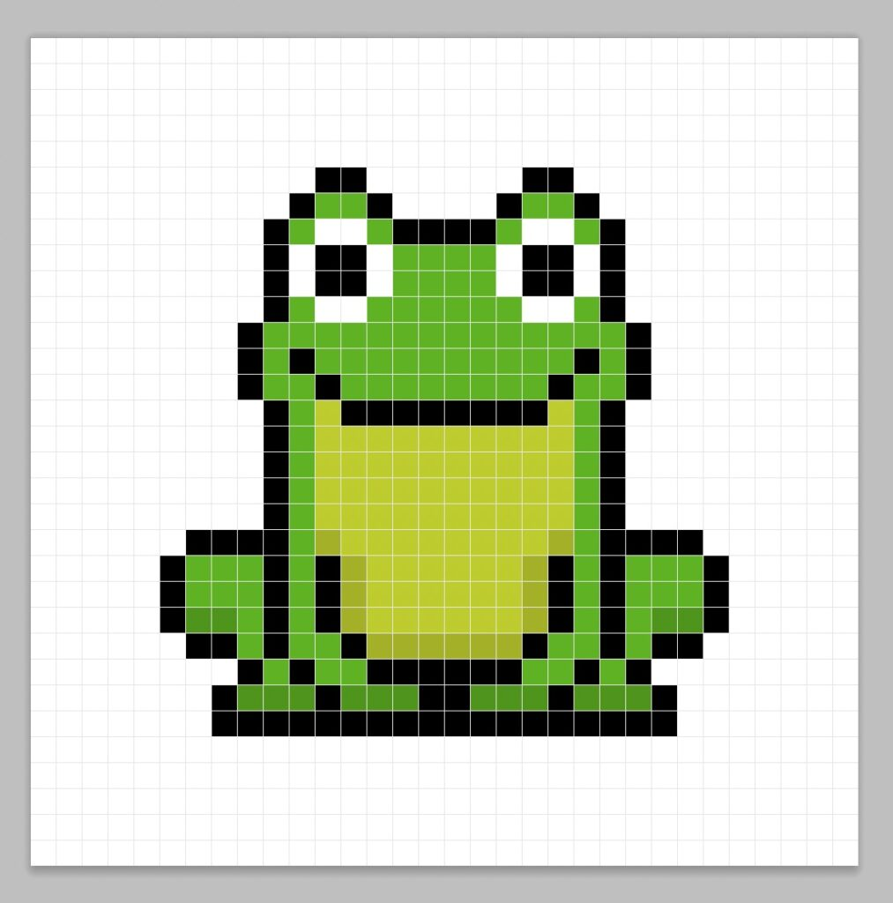
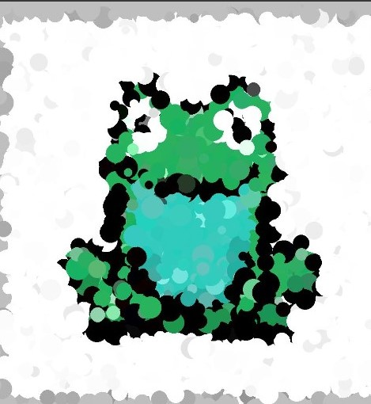

# Image Reconstruction with Genetic Algorithm

This project implements a genetic algorithm for image reconstruction. The goal is to evolve a population of random images to resemble a target image.

## Requirements

To run this project, you need to have the following libraries installed:

- NumPy
- Matplotlib
- PIL (Python Imaging Library)

## Usage

1. Clone the repository to your local machine.
2. Place the target image you want to reconstruct in the same directory as the script.
3. Open the script file `image_reconstruction.py`.
4. Adjust the genetic algorithm parameters if needed:
   - `population_size`: The size of the population (default: 100).
   - `generations`: The number of generations to evolve the population (default: 5000).
   - `mutation_rate`: The probability of mutation for each individual (default: 0.5).
5. In the `main()` function, specify the path to the target image by updating the `image_path` parameter in the `load_image()` function call.
6. Save the script file.
7. Run the script using a Python interpreter: `python image_reconstruction.py`.
8. The script will generate the reconstructed image and save it as `reconstructed_image.jpg` in the same directory.
9. The original and reconstructed images will be displayed side by side in a matplotlib window.

## Examples

Here are some examples of reconstructed images using this algorithm:

 
